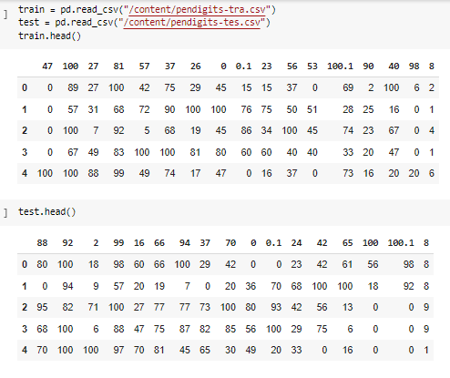

# Bagging and boosting with SVM and Decision tree algorithms.

## Description
In this assignment, we had dataset splitted into train and test.

we used bagging and boosting with SVM and Decision tree algorithms, to reduce the variance and avoid overfitting.

## Comparison between gradient boosting and XGBoost: 

The two models produced a close accuracy score of 96.57% for gradient 
boosting and 96.48% for XGBoost. So, we can say the best is XGBoost 
because the time consumption in XGBoost is less than the time 
consumption in gradient boosting. Moreover, the XGBoost performs 
regularization which avoids the overfitting of the training set (the 
regularization we used in the model is 1, the default).

  #  Conclusion:
  We had done bagging with SVM and Decision tree algorithms, to reduce the variance and avoid overfitting. The accuracy we gathered from 
these two algorithms is 97.9% for SVM and 94.8% for decision tree. Then, we 
used a soft voting classifier and a hard voting classifier in seeking to improve the 
accuracy of our models, which the soft voting classifier was based on predicting 
the output by using the average of probability while the hard voting classifier 
was based on predicting the output by using the majority of votes. The accuracy 
we gathered from these two algorithms is 96% for the soft voting classifier and 
97.6% for the hard voting classifier. After that, we try to build boosting 
algorithms based on combining several weak learners with poor accuracy to 
build a strong learner with higher accuracy. First, we tried boosting algorithm 
with a gradient boosting algorithm which technique fitting a new predictor to 
the residual errors made by the previous predictor. then, we made a 
hyperparameter tuning to find the best combinations between the learning rate 
and no of the estimator and we found the best combination is no. of the estimator 
is 200 and the learning rate is 0.1. the accuracy we gathered is 96.6%. After that, 
we have done the XGBoost algorithm which is an optimizer gradient boosting 
machine learning and we used the same hyperparameters that we used in the 
gradient boosting classifier. The accuracy we gathered is 96.5% the same as the 
gradient boosting algorithm but XGBoost succeeds the gradient boosting 
algorithm by regularization. Finally, the bagging algorithm perform well than 
boosting algorithms.

